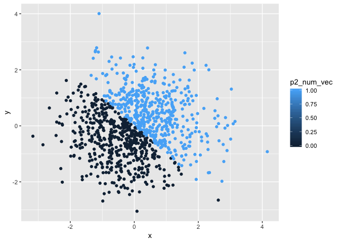
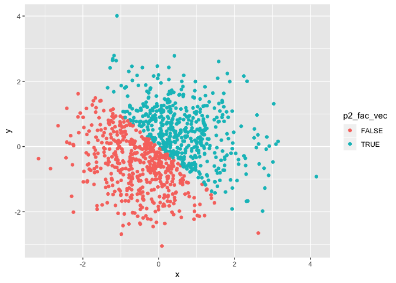

Homework 1 for Data Science I
================
Tatini Mal-Sarkar
September 14, 2018

``` r
##set seed for reproducibility's sake
set.seed(12)

##create dataframe with appropriate variables for problem 1
prob1_df = tibble(
  p1_random_samp = runif(10, min = 0, max = 5),
  p1_log_vec = p1_random_samp > 2,
  p1_char_vec = c('a','b','c','d','e','f','g','h','i','j'),
  p1_fac_vec = factor(p1_char_vec)
)

##try to take mean of each variable in dataframe prob1_df
##returns N/A for char_vec and fac_vec because the elements are neither numerical nor logical
mean(prob1_df$p1_random_samp)
```

    ## [1] 1.577018

``` r
mean(prob1_df$p1_log_vec)
```

    ## [1] 0.3

``` r
mean(prob1_df$p1_char_vec)
```

    ## Warning in mean.default(prob1_df$p1_char_vec): argument is not numeric or
    ## logical: returning NA

    ## [1] NA

``` r
mean(prob1_df$p1_fac_vec)
```

    ## Warning in mean.default(prob1_df$p1_fac_vec): argument is not numeric or
    ## logical: returning NA

    ## [1] NA

``` r
##convert logical, character, and factor variables to numeric
##my logical variable and factor variable have been converted to numeric, but an error tells me N/A forced by coercion for my character variable
as.numeric(prob1_df$p1_log_vec)
as.numeric(prob1_df$p1_char_vec)
```

    ## Warning: NAs introduced by coercion

``` r
as.numeric(prob1_df$p1_fac_vec)
```

``` r
##convert character to factor to numeric
##this successfully converts
as.numeric(as.factor(prob1_df$p1_char_vec))
##convert factor to character to numeric
##all elements become NA. An error says they are introduced by coercion.
as.numeric((as.character(prob1_df$p1_fac_vec)))
```

    ## Warning: NAs introduced by coercion

``` r
##set seed for reproducibility's sake
set.seed(903)

##create dataframe with appropriate variables for problem 2
prob2_df = tibble(
  x = rnorm(1000),
  y = rnorm(1000),
  p2_log_vec = x + y > 0,
  p2_num_vec = as.numeric(p2_log_vec),
  p2_fac_vec = as.factor(p2_log_vec)
)
```

short description of dataframe prob2\_df
----------------------------------------

The **size** of the dataset `prob2_df` is 5000 observations. The **mean** and **median** of x are 0.038678 and 0.024262, respectively. The proportion of cases where the logical vector is **true** is 0.495.

``` r
##scatter plot of y vs. x with color based on logical vector
##color code: red is false, blue is true
ggplot(prob2_df, aes(x = x, y = y, color = p2_log_vec)) + geom_point()
```


``` r
ggsave("p8105_hw1_tm2680_plot.png")
```

    ## Saving 7 x 5 in image

``` r
##scatter plot of y vs. x with color based on numerical vector
##color code: dark blue is when the element's numerical vector equals 0, and bright blue is when the element's numerical vector equals 1
ggplot(prob2_df, aes(x = x, y = y, color = p2_num_vec)) + geom_point()
```



``` r
##scatter plot of y vs. x with color based on factor vector
#color code: red is false, blue is true
ggplot(prob2_df, aes(x = x, y = y, color = p2_fac_vec)) + geom_point()
```


